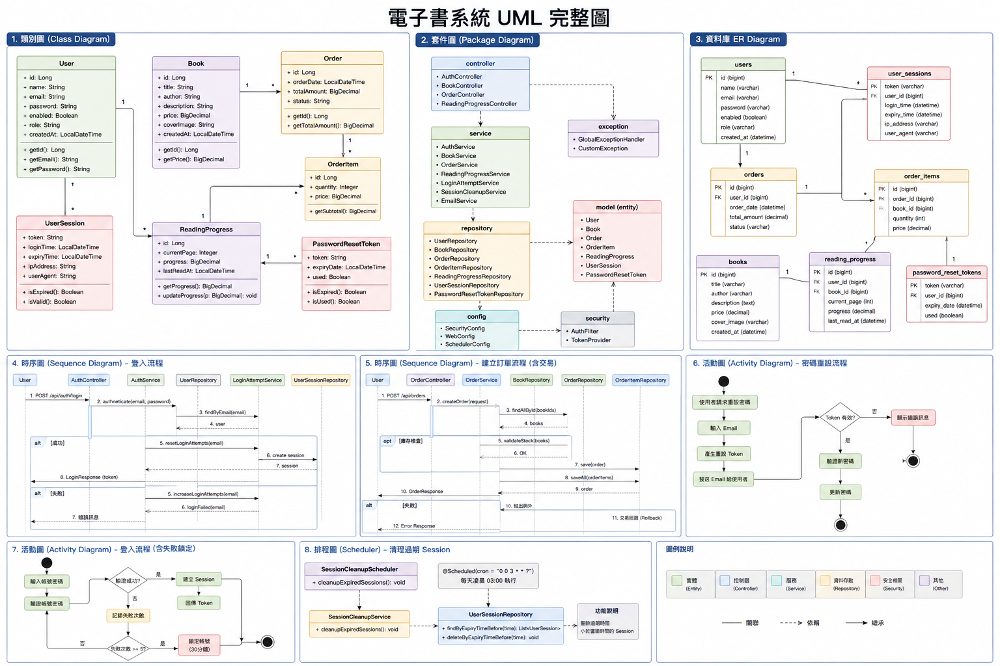

# E-Book Platform Backend System

## 專案簡介

本專案為一個使用 Spring Boot 開發的電子書平台後端系統，實作會員認證、書籍管理、訂單處理、閱讀進度追蹤與系統維運功能。

系統設計重點在於：

* 系統可維護性（分層架構）
* 資料一致性（Transaction 管理）
* 安全性（登入限制 / Token / Session 管理）
* 系統穩定性（排程與清理機制）

---

## 系統架構

### 分層架構（Layered Architecture）

```
Client → Controller → Service → Repository → Database
```

### 設計原則

* 單一職責（SRP）
* 低耦合、高內聚
* 分層解耦
* 交易一致性（ACID）

---

## UML 系統設計圖

<p align="center">
  
</p>

包含：

* Class Diagram（類別圖）
* Package Diagram（套件圖）
* Sequence Diagram（登入 / 訂單流程）
* Activity Diagram（流程圖）
* 排程機制圖

---

## 核心功能

### 使用者與認證系統

* 使用者註冊 / 登入
* 登入失敗次數限制（防暴力破解）
* Session-based Token 驗證機制（Access Token + Refresh Token）
* 密碼重設（Email + Token）

---

### 書籍系統

* 書籍列表查詢（分頁）
* 書籍詳細資訊
* 管理員書籍 CRUD（含封面上傳）

---

### 書架系統

* 新增 / 移除書架書籍
* 查詢使用者書架

---

### 訂單系統

* 建立訂單（支援多本書）
* 使用 OrderItem 設計訂單明細
* 訂單金額計算
* 使用 `@Transactional` 保證資料一致性

---

### 閱讀進度系統

* 記錄使用者閱讀進度
* 支援續讀功能

---

### 系統排程

* 每日自動清理過期 Session（@Scheduled）

---

## 安全設計

### 為什麼使用 Session Token 而不是 JWT？

| 項目        | Session Token | JWT |
| --------- | ------------- | --- |
| Server 控制 | 高             | 低   |
| 強制登出      | 容易            | 困難  |
| Token 撤銷  | 即時            | 困難  |
| 擴展性       | 中等            | 高   |

設計選擇：
本系統採用 DB-based Session Token，優先考量安全性與可控性。Access Token 有效期 1 小時，搭配 30 天 Refresh Token 自動換發。

---

## 交易機制（Transaction）

```java
@Transactional
public Order createOrder(...) {
    // 建立訂單與訂單明細
}
```

設計目的：

* 保證訂單與訂單明細同時成功
* 任一失敗 → 全部 rollback
* 避免資料不一致

---

## 核心設計思考

### Order + OrderItem 設計

```
Order → OrderItem → Book
```

原因：

* 支援一筆訂單多本書
* 避免 Order 與 Book 強耦合
* 符合電商系統設計

---

### Session 管理機制

* 登入後產生 Token 並儲存在 DB
* 支援多裝置登入
* 支援強制登出
* 支援 Session 過期控管

---

### 全域例外處理（Global Exception）

```java
@RestControllerAdvice
public class GlobalExceptionHandler {
}
```

優點：

* 統一錯誤回應格式
* 減少 Controller 重複邏輯
* 提升可維護性

---

### 排程清理機制

```java
@Scheduled(cron = "0 0 3 * * *")
```

用途：

* 清除過期 Session
* 避免資料庫膨脹
* 提升系統效能

---

## 專案結構

```
com.ebook
├── controller
├── service
├── repository
├── model
├── dto
├── security
├── config
├── scheduler
└── exception
```

---

## 技術棧

* Java 21
* Spring Boot 4.0.5
* Spring Data JPA
* Hibernate
* MariaDB
* Lombok
* Springdoc OpenAPI（Swagger UI）

---

## 啟動方式

```bash
git clone https://github.com/your-repo/ebook-system.git
cd ebook-system
mvn spring-boot:run
```

## 未來優化方向

* 雲端檔案儲存（書籍封面 / PDF）
* Docker 容器化
* CI/CD 自動部署

---

## 作者

Ethan

---

## 專案總結

本專案展示：

* 後端分層架構設計能力
* 電商資料模型設計（Order / OrderItem）
* Transaction 管理能力
* 系統安全設計（Session Token / RBAC / 暴力破解防護）
* API 文件化（Swagger UI）
* 單元測試（JUnit + Mockito，29 個測試案例）
* 系統維運思維（排程清理 / Flyway 版本管理）